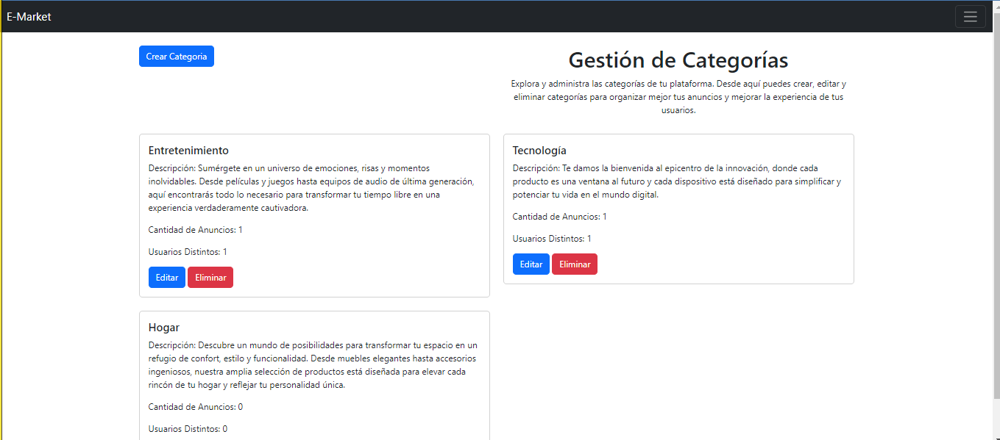

<h1 align="center"> E-Market</h1>
<p align="center"></p> 

## Tabla de contenidos:


- [Descripción y contexto](#descripción-y-contexto)
- [Guía de usuario](#guía-de-usuario)
- [Guía de instalación](#guía-de-instalación)
- [Cómo contribuir](#cómo-contribuir)
- [Código de conducta](#código-de-conducta)
- [Autor/es](#autores)
- [Información adicional](#información-adicional)

## Descripción y contexto

E-Market es una aplicación web diseñada para facilitar la compra y venta de productos en un entorno virtual. Desarrollada utilizando el framework Django, esta plataforma ofrece a los usuarios una experiencia intuitiva y segura para navegar por una amplia variedad de anuncios y realizar transacciones comerciales.


## Guía de usuario
### LOGIN:
Esta sección te permite acceder a tu cuenta de usuario. Ingresa tu nombre de usuario y contraseña para iniciar sesión y acceder a todas las funcionalidades del sistema.


### REGISTRO:
Si eres nuevo en el sistema, puedes registrarte aquí. Proporciona la información requerida, como tu nombre de usuario, correo electrónico y contraseña, para crear una nueva cuenta.


### HOME:
La página de inicio es el punto de partida de la aplicación. Aquí encontrarás una vista general de las últimas actualizaciones y anuncios.


### MIS ANUNCIOS:
En esta sección, puedes administrar tus propios anuncios. Puedes editarlos, eliminarlos o agregar nuevos anuncios según sea necesario.


### CREACION DE ANUNCIOS:
Utiliza esta página para crear nuevos anuncios. Ingresa la información del anuncio, como título, descripción, precio y categoría, y luego guárdalo para que otros usuarios lo vean.


### CATEGORIAS:
Aquí puedes ver todas las categorías disponibles en el sistema. También puedes ver cuántos anuncios están asociados a cada categoría y cuántos usuarios han utilizado esas categorías en sus anuncios.


### CREACION DE CATEGORIAS:
Si necesitas crear una nueva categoría para tus anuncios, puedes hacerlo en esta sección. Simplemente proporciona un nombre y una descripción para la nueva categoría y guárdala en el sistema.


Explica los pasos básicos sobre cómo usar la herramienta digital. Es una buena sección para mostrar capturas de pantalla o gifs que ayuden a entender la herramienta digital.
 	
## Guía de instalación
Para instalar las dependencias del proyecto, puedes utilizar el gestor de paquetes pip. A continuación, se detallan las librerías necesarias:

```bash
    pip freeze  > requirements.txt
```

Recuerda que es importante tener un entorno virtual activado antes de instalar las dependencias para evitar conflictos con otras aplicaciones Python en tu sistema. Puedes crear un entorno virtual utilizando `virtualenv` o `venv`.

*Usando `virualenv`:*
```bash
# Crear un entorno virutal
    virtualenv -p python env

# Activar el entorno virtual (Windows)
    \env\Scripts\activate

# Activar el entorno virtual (Unix o MacOS)
    source /env/Scripts/activate

```

*Usando`venv`:*
```bash
# Crear un entorno virtual
    python -m venv myenv

# Activar el entorno virtual (Windows)
    myenv\Scripts\activate

# Activar el entorno virtual (Unix o MacOS)
    source myenv/bin/activate
```

## Dependencias
A continuación se detallan las dependencias del proyecto junto con las últimas versiones en las que ha sido probado:

- **Django:** Framework de desarrollo web de alto nivel escrito en Python. Versión probada: 5.0.2
    ```bash
        pip install Django
    ```

- **asgiref:** Biblioteca para compatibilidad entre servidores web y aplicaciones Python WSGI/ASGI. Versión probada: 3.7.2
    ```bash
        pip install asgiref
    ```

- **Brotli:** Biblioteca de compresión de datos sin pérdida. Versión probada: 1.1.0
    ```bash
        pip install Brotli
    ```

- **packaging:** Biblioteca para la gestión de versiones y distribuciones de paquetes Python. Versión probada: 23.2
    ```bash
        pip install packaging
    ```

- **Pillow:** Biblioteca de procesamiento de imágenes para Python. Versión probada: 10.2.0
    ```bash
        pip install Pillow
    ```

- **sqlparse:** Biblioteca para analizar SQL y formatear sentencias SQL. Versión probada: 0.4.4
    ```bash
        pip install sqlparse
    ```

- **typing_extensions:** Extensiones de tipos para el chequeo de tipos estáticos en Python. Versión probada: 4.9.0
    ```bash
        pip install typing_extensions
    ```

- **tzdata:** Base de datos de zonas horarias para Python. Versión probada: 2023.4
    ```bash
        pip install tzdata
    ```

Estas dependencias son fundamentales para el funcionamiento correcto del proyecto y deben ser instaladas antes de ejecutar la aplicación. Utiliza los comandos de instalación proporcionados en la sección "Guía de instalación" para configurar el entorno de desarrollo correctamente.

## Cómo contribuir

¡Me encantaría que contribuyeras al desarrollo de este proyecto! Si estás interesado en colaborar, aquí tienes algunas formas en las que puedes hacerlo:

- Realiza un fork del repositorio y prueba el proyecto en tu propio entorno.

- Identifica posibles mejoras, correcciones de errores o nuevas características que podrían añadirse al proyecto.

- Crea una nueva rama en tu fork para trabajar en la mejora o corrección que desees implementar.

- Realiza tus cambios y asegúrate de seguir las guías de estilo y convenciones de codificación del proyecto.

- Haz un pull request con tus cambios, describiendo claramente el propósito de tu contribución y los cambios realizados.

- Participa en discusiones abiertas y colabora con otros contribuyentes en el proceso de revisión de código y mejora continua del proyecto.

¡Tu ayuda es muy apreciada y contribuirá al crecimiento y la mejora constante de la herramienta!

## Código de conducta 
- Este proyecto sigue el [Código de Conducta de Colaboradores de Código Abierto de GitHub](https://opensource.guide/code-of-conduct/). Te pedimos que leas detenidamente este código de conducta para comprender las expectativas de comportamiento tanto como colaborador como participante en la comunidad de este proyecto. Se espera que todos los colaboradores y participantes sigan este código en todas las interacciones relacionadas con el proyecto.

## Autor/es
- Dextron_py

## Información adicional
Este proyecto representó un desafío emocionante para mí, ya que fue la primera vez que trabajé con los modelos de usuario y autenticación de Django. Disfruté cada paso del proceso y aprendí mucho en el camino. Espero con entusiasmo la posibilidad de enfrentar más proyectos como este en el futuro, con la gracia de Dios, y seguir mejorando en mi trayectoria como desarrollador.
